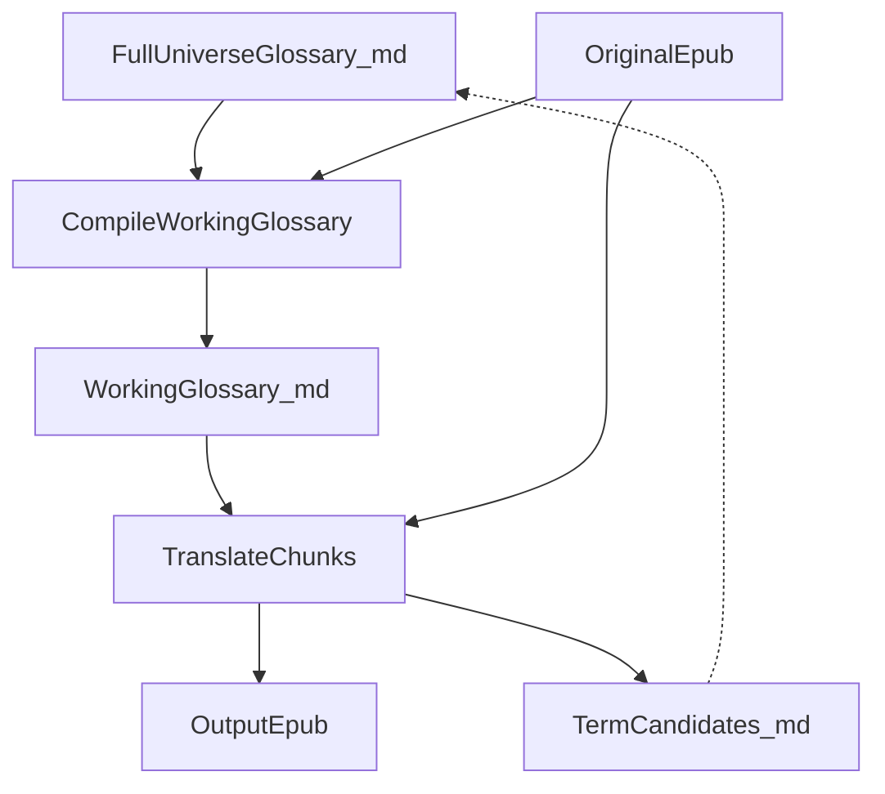

# Архитектура

## Границы MVP

В v1 есть:

- CLI для себя
- EPUB → EPUB
- один целевой язык: русский
- словарь в Markdown
- полный корпус вселенной + рабочий словарь книги
- перевод по главам/кускам со стабильным префиксом
- ретраи по структуре ответа, чекпоинты, дырки с логом
- три провайдера за одним контрактом: OpenAI, OpenRouter, Provod.ai

В v1 нет:

- веб, очереди, личных кабинетов
- PDF как входа
- полностью автоматического словаря без ревью
- мини-словаря на каждый чанк
- редакторского второго прогона всей книги
- парсинга вики/форумов
- эталона стиля из чужого перевода в префиксе

## Проекты

Три сборки, не больше. `tools/glossary-ingest` появляется только из [backlog.md](backlog.md).

```
src/Ai.Translator.Cli      — хост, команды, код возврата
src/Ai.Translator.Core     — домен и вся бизнес-логика
tests/Ai.Translator.Tests  — unit-тесты Core
```

Cli тонкий: биндинг аргументов, резолв сервиса, печать ошибок, exit code.  
Core толстый: словарь, EPUB, нарезка, пайплайн, провайдеры.

Не создавать `Ai.Translator.Infrastructure`, `Ai.Translator.Domain` и прочие сборки «на вырост».

## Слои внутри Core

Папки, не проекты:

| Папка | Ответственность |
| --- | --- |
| `Domain` | `GlossaryDocument`, `GlossaryEntry`, глава, чанк, состояние job |
| `Abstractions` | порты: LLM, EPUB, компилятор, чекпоинты |
| `Glossary` | парсер/писатель MD, компилятор, матчер |
| `Epub` | чтение spine, замена XHTML в копии ZIP |
| `Translation` | префикс, чанкер, валидатор, пайплайн, чекпоинты |
| `Llm` | OpenAI-compatible клиент и стратегии кеша |
| `Options` | `TranslatorOptions`, `LlmOptions`, профили моделей |

## Потоки

### Компиляция рабочего словаря

Полный корпус вселенной пересекается с текстом оригинала. Результат — отдельный MD, стабильный на всю книгу (или серию, если лексикон тот же).

### Перевод

Префикс = правила стиля + рабочий словарь. Он одинаков на все чанки книги. В запрос уходит только HTML/текст куска. После перевода чанки склеиваются в исходные XHTML и пишутся в копию EPUB.

Новые термины — кандидаты в отдельный файл. В текущий префикс их не подмешивают: иначе сломается cache и канон.

### Наполнение корпуса

Эпоха 05: модель предлагает пары из оригинала и уже существующего перевода. Слияние в полный MD, человек ревьюит. Это другой режим модели, не перевод.



## CLI-поверхность

Имена команд фиксируем здесь, эпохи их наполняют, но не переименовывают.

```
ai-translator glossary compile --corpus <md> --book <epub> --out <md>
ai-translator glossary extract --original <epub> --translation <epub> --out <md>
ai-translator translate --input <epub> --glossary <md> --out <epub>
            [--provider <name>] [--model <id>] [--work-dir <path>] [--resume]
```

`glossary extract` появляется в эпохе 05. До этого команда может существовать как заглушка с понятной ошибкой «эпоха не реализована», либо отсутствовать — см. эпоху 00.

## DI и конфигурация

- Регистрация в одном месте: `ServiceCollectionExtensions` в Core, вызов из Cli Host.
- Тяжёлые I/O-объекты не создаются через `new` в бизнес-логике. `HttpClient` — только из `IHttpClientFactory`.
- Конфиг — `IOptions<TranslatorOptions>` и `IOptions<LlmOptions>`.
- Провайдеры не keyed services. `ILlmProviderResolver.Resolve(string name)` читает `LlmOptions` и выдаёт адаптер.
- Именованные HttpClient: `openai`, `openrouter`, `provod`. BaseAddress и Authorization настраиваются при регистрации.
- Время — `TimeProvider` (ретраи, задержки).
- Логирование через `ILogger<T>`. Тела промптов с полным словарём в Information не писать.

## Контракт LLM

Один порт на всех провайдеров:

```
ILlmProvider
  Name: string
  CompleteAsync(LlmRequest, CancellationToken) -> LlmResponse

LlmRequest
  Model
  StablePrefix      // кешируемая неизменяемая часть
  VariableContent   // чанк / пара глав для extract
  MaxOutputTokens
  Temperature

LlmResponse
  Content
  FinishReason
  PromptTokens
  CachedTokens
```

Стратегия кеша — деталь `Llm`, не пайплайна:

- OpenAI: `StablePrefix` первым system-сообщением, без спецполей
- OpenRouter: то же + `cache_control: ephemeral` на префиксе (для Anthropic через шлюз)
- Provod.ai: тот же OpenAI-compatible POST `/chat/completions`, без кеша = дороже, контракт тот же

Нарезка глав смотрит на `ContextWindowTokens` выбранной модели минус резерв под префикс и ответ. Оценка токенов в v1 — эвристика (длина/4), отдельный tokenizer не тащим.

## EPUB

Читаем `VersOne.Epub` (reading order, пути файлов, XHTML).  
Пишем так: копируем исходный файл, открываем как ZIP, заменяем только переведённые XHTML. Не пересобираем OPF/TOC/картинки.

Порядок entry `mimetype` не ломаем: не создаём архив с нуля, только `ZipArchiveMode.Update` по копии.

## Чекпоинты

Рабочая директория перевода (по умолчанию рядом с `--out` или явный `--work-dir`):

- `state.json` — вход, выход, провайдер, модель, хеш префикса, статусы чанков
- файлы исходного и переведённого чанка
- лог ошибки чанка после исчерпания ретраев

`--resume` продолжает незавершённые чанки. Если хеш префикса изменился (другой словарь), resume без явного подтверждения/флага пересборки не имеет права молча мешать старые переводы с новым каноном. Поведение флага — в эпохе 03.

## Тестирование

xUnit + Moq. Проверяем не только return value, но и побочные эффекты через `Verify`, где есть порт записи.

Обязательные классы тестов по мере эпох:

- round-trip Markdown словаря
- компилятор отбирает только встречаемые термины + алиасы/дефисы
- чанкер уважает бюджет токенов
- валидатор ловит пусто, обрыв, английские связки, дырки в абзацах
- сборка запроса OpenRouter содержит `cache_control`, OpenAI — нет
- EPUB: минимальная валидная книга переживает replace XHTML

Интеграционные вызовы живых API в v1 не обязательны.

## Инженерные инварианты

- Нет `.Result` / `.Wait()`
- Входные ссылочные аргументы публичных сервисов проверяются на null
- Коллекции из EPUB/файла не перечисляются многократно без необходимости — сохранить в локальную переменную
- Магических URL, ключей и размеров окна в бизнес-методах нет: только Options
